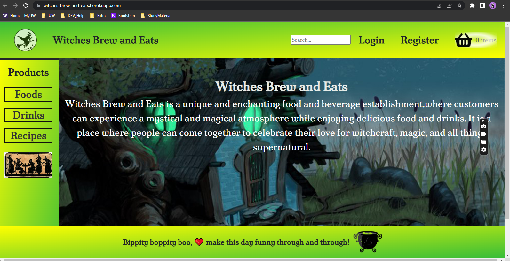
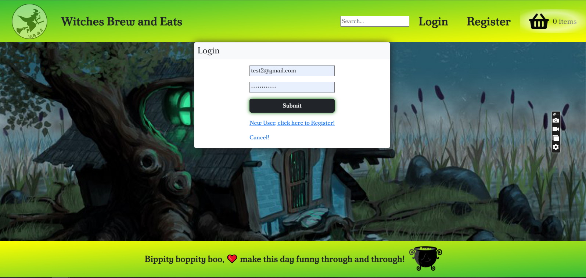
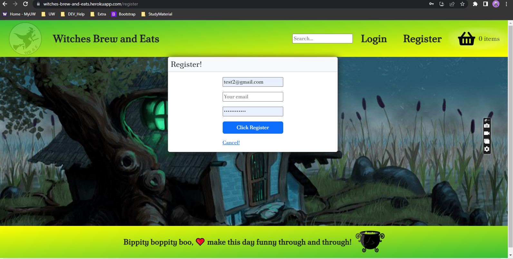
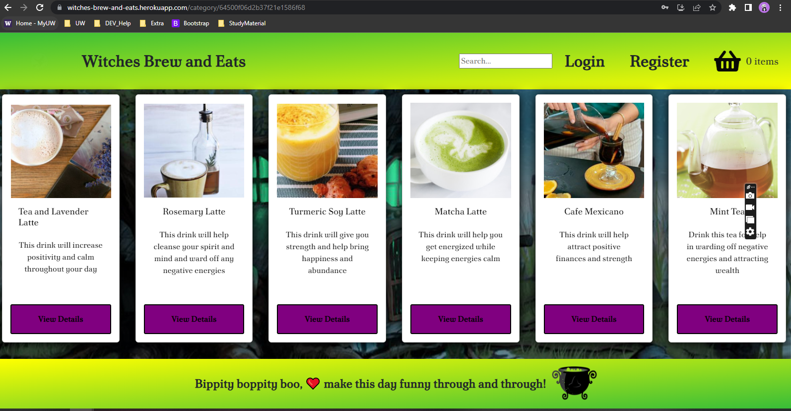
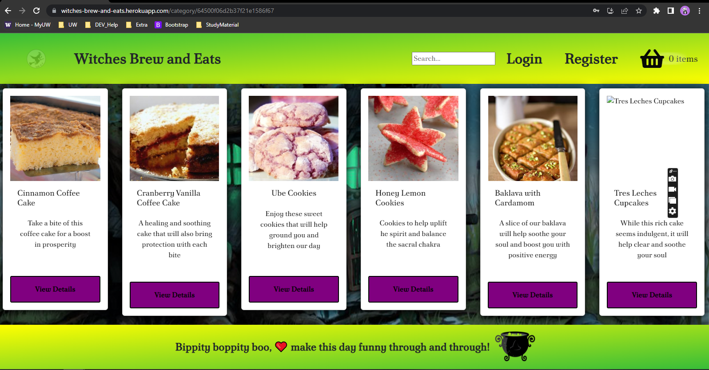
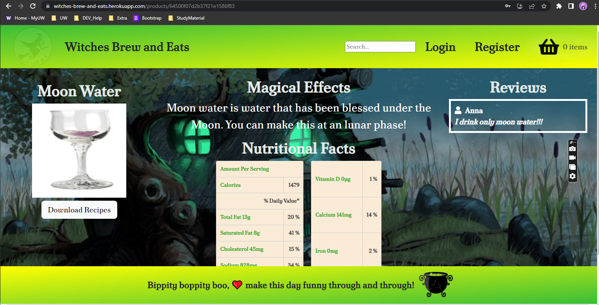
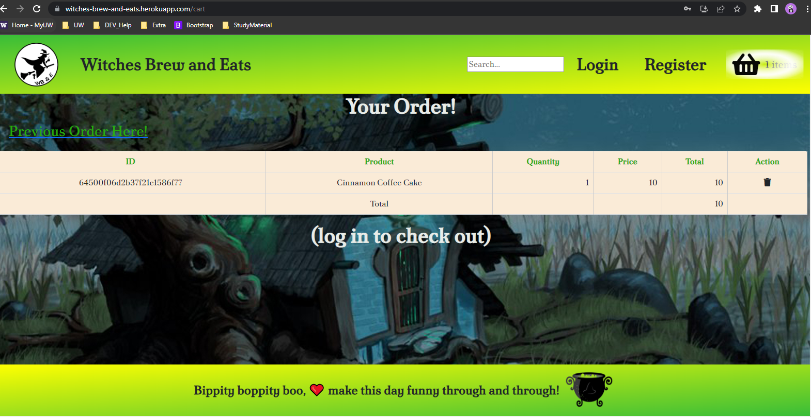
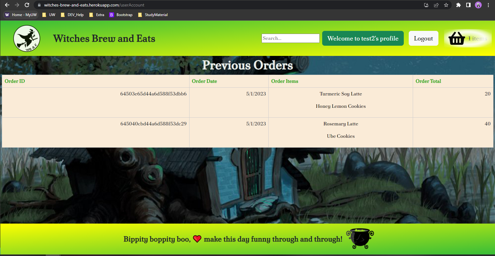
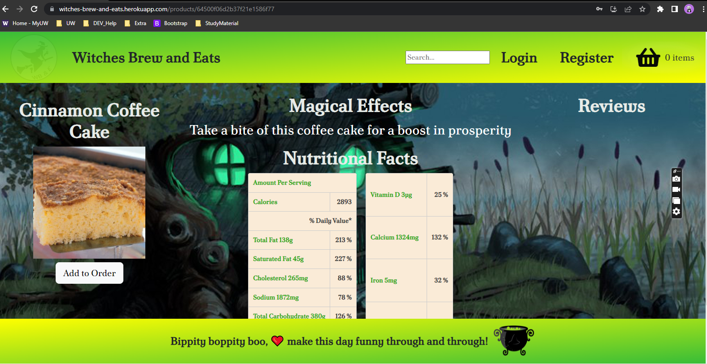
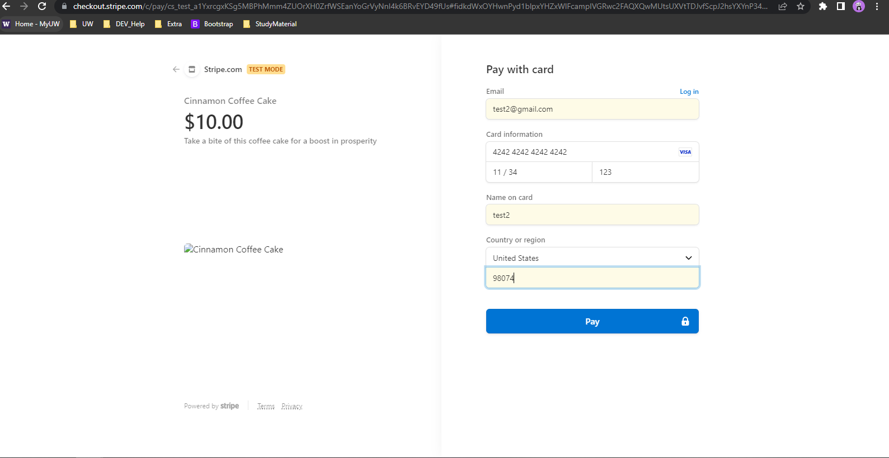

# WITCHES BREW & EATS

## Table of Content 📖
  - [Description](#description)
  - [User Story](#user-story)
  - [Acceptance Criteria](#acceptance-criteria)
  - [Database Structure](#database-structure)
  - [WireFrame](#wireframe)
  - [Technologies](#technologies)
  - [Installation](#installation)
  - [Results](#results)
  - [Reach-us](#reach-us)
  - [GitRepo](#gitrepo)
  - [App-Link](#app-link)

  ## Description

Witches Brew and Eats is a unique and enchanting food and beverage establishment, where customers can experience a mystical and magical atmosphere while enjoying delicious food and drinks. It is a place where people can come together to celebrate their love for witchcraft, magic, and all things supernatural. 

## User Story

```md
As a consumer who loves all things mystical and delicious
I WANT a platform to view different menu items, make an account that tracks how many points I’ve earned, add items to my cart, and look at free recipes
SO THAT I can make an order that will be ready within 15 minutes
```


## Acceptance Criteria

```md
Scenario 1: View Menu Items
Given I am on the Witches Brew and Eats homepage
When I click on the "Products"
Then I should be able to view a list of different menu items with their prices and descriptions

Scenario 2: Create an Account
Given I am on the Witches Brew and Eats homepage
When I click on the "Register" button
Then I should be redirected to the registration page where I can create an account by providing my name, email and password

Scenario 3: Log-in to an Account
Given I am on the Witches Brew and Eats homepage
When I click on the "Login" button
Then I should be redirected to the Login page where I can enter email and password and click Submit

Scenario 4: Track My Points
Given I am logged in to my Witches Brew and Eats account
When I make a purchase
Then I should earn points based on the total amount spent, which should be displayed on my account dashboard

Scenario 5: Add Items to Cart
Given I am on the Witches Brew and Eats homepage
When I click on the "Add to Cart" button next to a menu item
Then the item should be added to my cart, and the cart total should be updated accordingly

Scenario 6: Look at Free Recipes
Given I am on the Witches Brew and Eats homepage
When I click on the "Recipes" button
Then I should be able to view a list of free recipes with their ingredients and instructions

Scenario 7: Order Ready Within 15 Minutes
Given I have added items to my cart and proceeded to checkout
When I select a pickup time
Then the platform should confirm that the order will be ready within 15 minutes

Scenario 8: Order checkout
Given I have added items to my cart and proceeded to checkout
When I click the chekout button
Then the platform should take me to the Payment gateway page
```
## Database Structure


## WireFrame


## Technologies

<table border="10">
    <thead>
      <tr>
        <th>Name</th>
        <th>Technology</th>
        <th>Description</th>
        </tr>
    </thead>
    <tbody>
        <tr>
            <td>React</td>
            <td>Front-end</td>
            <td>A JavaScript library for building user interfaces.</td>
        </tr>
        <tr>
            <td>Node.js</td>
            <td>Backend(server-side)</td>
            <td>A JavaScript runtime built on Chrome's V8 JavaScript engine.</td>
         </tr>
         <tr>
            <td>Express.js</td>
            <td>Backend(server-side)</td>
            <td>A minimal and flexible Node.js web application framework.</td>
         </tr>
          <tr>
            <td>MongoDB</td>
            <td>Backend(server-side)</td>
            <td>A NoSQL database that stores data in flexible, JSON-like documents.</td>
         </tr>
         <tr>
            <td>Mongoose</td>
            <td>Backend(server-side)</td>
            <td>A MongoDB object modeling tool that provides a schema-based solution to model your application data.</td>
         </tr>
         <tr>
            <td>GraphQL</td>
            <td>API</td>
            <td>For improved API performance and efficiency.</td>
         </tr>
          <tr>
            <td>NPM(Node Package Manager)</td>
            <td>Development Tool</td>
            <td>A package manager for the JavaScript programming language.</td>
         </tr>
          <tr>
            <td>Git</td>
            <td>Development Tool</td>
            <td>A distributed version control system used for source code management.</td>
         </tr>
         <tr>
            <td>VS Code</td>
            <td>Development Tool</td>
            <td>A popular source code editor developed by Microsoft.</td>
         </tr>
          <tr>
            <td>JWT(JSON Web Tokens)</td>
            <td>Other tools and technologies</td>
            <td>A standard for securely transmitting information between parties as a JSON object.</td>
         </tr>
          <tr>
            <td>Heroku</td>
            <td>Other tools and technologies</td>
            <td>A cloud platform as a service (PaaS) used for deploying, managing, and scaling web applications.</td>
         </tr>  
         <tr>
            <td>Stripe</td>
            <td>Payment Processing Platform</td>
            <td>Stripe enables businesses to accept payments online</td>
         </tr>          
    </tbody>
  </table>


## Installation:

- Download it through Github
- Run npm i in terminal to install packages
- Running npm run develop will give you access to the Apollo Server (Graph QL) and the localhost webpage

## Results:

Pages - Homepage, Login, Register, Cart, Checkout and Previous Order





















## Reach-Us

https://github.com/SPloganathan

https://github.com/LenaChe2022

https://github.com/LillyRWonka

https://github.com/jenjen0219

https://github.com/jessyjdi


## GitRepo

https://github.com/SPloganathan/witches-brew-and-eats

## App-Link

https://witches-brew-and-eats.herokuapp.com
