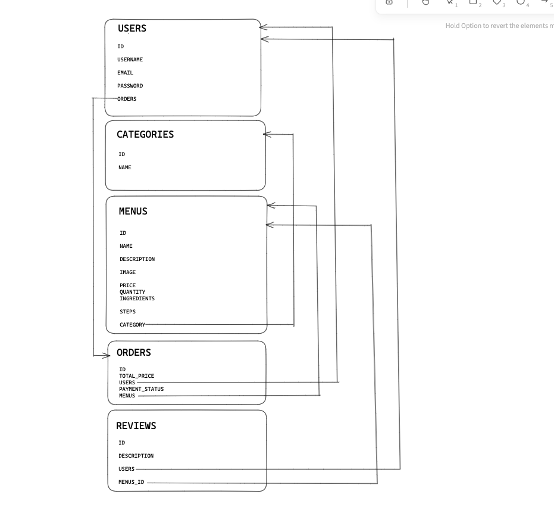
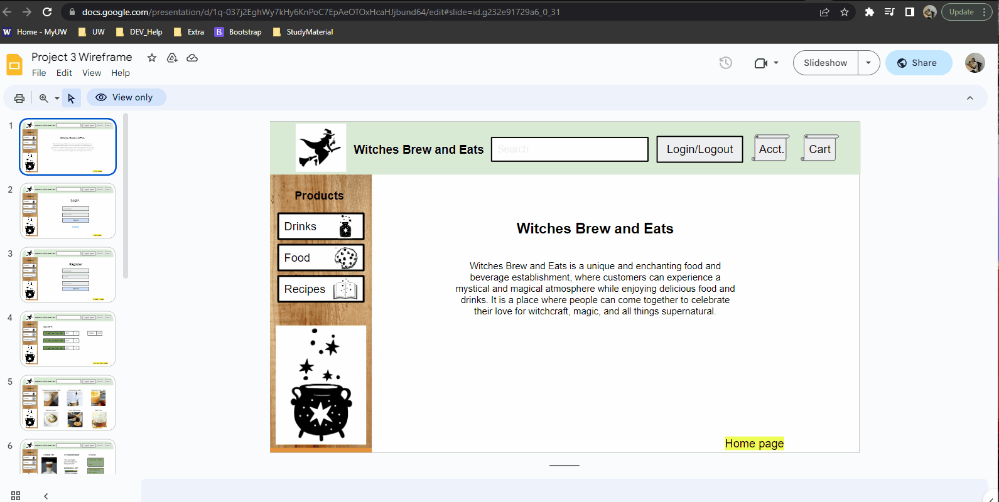

# WITCHES BREW & EATS

## Table of Content 📖
  - [Description](#description)
  - [User Story](#user-story)
  - [Acceptance Criteria](#acceptance-criteria)
  - [Database Structure](#database-structure)
  - [WireFrame](#wireframe)
  - [Installation](#installation)
  - [Results](#results)
  - [Reach-us](#reach-us)
  - [GitRepo](#gitrepo)
  - [App-Link](#app-link)

  ## Description

Witches Brew and Eats is a unique and enchanting food and beverage establishment, where customers can experience a mystical and magical atmosphere while enjoying delicious food and drinks. It is a place where people can come together to celebrate their love for witchcraft, magic, and all things supernatural. 

## User Story

```md
TO-DO........
```


## Acceptance Criteria

```md
TO-DO........
```
## Database Structure



## WireFrame




## Installation:

- Download it through Github
- Run npm i in terminal to install packages
- Running npm run develop will give you access to the Apollo Server (Graph QL) and the localhost webpage

## Results:


## Reach-Us

https://github.com/SPloganathan

https://github.com/LenaChe2022

https://github.com/LillyRWonka

https://github.com/jenjen0219

https://github.com/jessyjdi


## GitRepo

https://github.com/SPloganathan/witches-brew-and-eats

## App-Link

TO-DO.......
